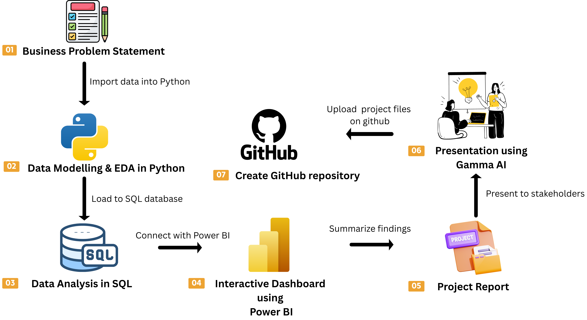

# Customer Shopping Behavior Analysis


## 📌 Project Overview
The goal of this project is to simulate a corporate-grade end-to-end data analytics workflow, demonstrating the ability to translate raw data into strategic business intelligence by:

✅ Data Preparation,Modeling & Exploratory Data Analysis (Python): Clean and transform the raw dataset for analysis.

✅ Data Analysis (SQL): Simulate business transactions, and run queries to extract insights on customer segments, loyalty, and purchase drivers.

✅ Visualization & Insights (Power BI): Build an interactive dashboard that highlights key patterns and trends, enabling stakeholders to make data-driven decisions.

✅ Report and Presentation: Write a clear project report summarizing your key findings and business recommendations. Prepare a presentation that visually communicates insights and actionable recommendations to stakeholders.




## 1. Project Overview

This project analyzes customer shopping behavior using transactional data containing **3,900 purchase records**. The objective is to understand customer demographics, purchasing patterns, product preferences, discount usage, subscription behavior, customer loyalty and revenue contribution.

The project follows an end-to-end analytics workflow:

**Python Data Preparation → Data Cleaning & Feature Engineering →PostgreSQL → SQL Business Analysis → Power BI Dashboard → Business Recommendations**

The analysis is designed to convert raw customer transaction data into actionable business insights.

--------------------------------------------------------------------------------------------------------------------------------------------------------------------------------------------------------------------

## 2. Problem Statement

The business wants to better understand how customers purchase products and what factors influence sales and customer value.

The key questions addressed in this project include:

-   Which customer groups generate the most revenue?
-   How do male and female customers contribute to revenue?
-   Do subscribers and non-subscribers differ in spending and revenue?
-   Which products have the highest customer ratings?
-   Which products depend most on discounts?
-   Which customers are high spenders even when using discounts?
-   How can customers be segmented based on previous purchases?
-   Which products are the most purchased within each category?
-   Are repeat buyers more likely to subscribe?
-   Which age groups contribute the most revenue?
-   How can these insights support marketing, loyalty, subscription, and
    product decisions?

--------------------------------------------------------------------------------------------------------------------------------------------------------------------------------------------------------------------

## 3. Dataset Summary

### Dataset Size

  Attribute                                                        Value
  ---------------------------------------------------- -----------------
  Rows / Transactions                                              3,900
  Original Columns                                                    18
  Missing Values                                                      37
  Column with Missing Values                             `review_rating`
  Final Columns After Cleaning & Feature Engineering                  19

The dataset represents **3,900 customer purchases** across multiple product categories.

### Data Categories

#### Customer Demographics

-   `customer_id`
-   `age`
-   `gender`
-   `location`
-   `subscription_status`

#### Purchase & Product Information

-   `item_purchased`
-   `category`
-   `purchase_amount`
-   `size`
-   `color`
-   `season`

#### Shopping & Transaction Behavior

-   `review_rating`
-   `shipping_type`
-   `discount_applied`
-   `previous_purchases`
-   `promo_code_used`
-   `payment_method`
-   `frequency_of_purchases`

#### Engineered Features

-   `age_group`
-   `purchase_frequency_days`


--------------------------------------------------------------------------------------------------------------------------------------------------------------------------------------------------------------------

## 4. Data Exploration Using Python

### Initial Data Inspection


-   **3,900 rows**
-   **18 original columns**
-   Most columns contained 3,900 non-null values.  review_rating` contained **3,863 non-null values**, resulting in  37 missing values**.

### Descriptive Statistics

`df.describe(include='all')` was used to understand numerical and categorical distributions.

Important observations:

  Metric                       Observation
  ---------------------------- ----------------
  Age                          18 to 70 years
  Average Age                  \~44.07 years
  Purchase Amount              \$20 to \$100
  Average Purchase Amount      \~\$59.76
  Review Rating                2.5 to 5.0
  Average Review Rating        \~3.75
  Previous Purchases           1 to 50
  Average Previous Purchases   \~25.35

For categorical variables, the dataset contains:

-   2 genders
-   25 purchased items
-   4 product categories
-   50 locations
-   4 sizes
-   25 colors
-   4 seasons
-   2 subscription statuses
-   6 shipping types
-   2 discount statuses
-   6 payment methods
-   7 purchase-frequency categories

------------------------------------------------------------------------

## 5. Data Cleaning

### 5.1 Missing Value Check

The following check was performed:

``` python
df.isnull().sum()
```

The analysis found:

-   `review_rating`: **37 missing values**
-   All other columns: **0 missing values**

### 5.2 Missing Value Imputation

Missing review ratings were replaced using the **median review rating
within each product category**.

``` python
df['review_rating'] = (
    df.groupby('category')['review_rating'].transform(lambda x: x.fillna(x.median()))
)
```

#### Why Median Imputation?

The median was selected because it is less affected by extreme values
than the mean. More importantly, calculating the median separately by
category preserves the rating pattern of each product category instead
of applying one overall value to every missing record.

--------------------------------------------------------------------------------------------------------------------------------------------------------------------------------------------------------------------

## 6. Column Standardization

The original column names were converted to **snake_case**.

Example:

-   `Customer ID` → `customer_id`
-   `Purchase Amount (USD)` → `purchase_amount`
-   `Review Rating` → `review_rating`
-   `Subscription Status` → `subscription_status`

The `purchase_amount_(usd)` column was specifically renamed to
`purchase_amount`.

### Benefits

Standardized column names:

-   Improve readability
-   Make Python code easier to write
-   Avoid spaces and special characters
-   Improve consistency across Python, SQL, and Power BI

--------------------------------------------------------------------------------------------------------------------------------------------------------------------------------------------------------------------

## 7. Feature Engineering

### 7.1 Age Group

Customers were grouped into four age segments:

  Age Range   Age Group
  ----------- -------------
  0--25       Young Adult
  25--35      Adult
  35--50      Middle-aged
  50--100     Senior

This was created using `pd.cut()`.

The `age_group` feature makes it easier to compare revenue and sales
across customer age segments.

### 7.2 Purchase Frequency in Days

The categorical purchase frequency was converted into an approximate
number of days:

  Purchase Frequency     Days
  -------------------- ------
  Weekly                    7
  Fortnightly              14
  Bi-Weekly                14
  Monthly                  30
  Quarterly                90
  Every 3 Months           90
  Annually                365

This created the new column:

`purchase_frequency_days`

The numerical feature can be used for customer frequency analysis,
comparisons, segmentation, and calculations.

--------------------------------------------------------------------------------------------------------------------------------------------------------------------------------------------------------------------

## 8. Data Consistency Check

The project checked whether `discount_applied` and `promo_code_used`
contained redundant information.

``` python
(df['discount_applied'] == df['promo_code_used']).all()
```

The result was:

``` text
True
```

This confirmed that both columns contained the same values across the
dataset.

Therefore:

``` python
df = df.drop('promo_code_used', axis=1)
```

was used to remove `promo_code_used`.

### Final Dataset Structure

Starting with **18 columns**:

-   Remove 1 redundant column → **17 columns**
-   Add `age_group` → **18 columns**
-   Add `purchase_frequency_days` → **19 final columns**

The number of records remains **3,900**.

--------------------------------------------------------------------------------------------------------------------------------------------------------------------------------------------------------------------

## 9. PostgreSQL Database Integration

After cleaning and feature engineering, the DataFrame was loaded into
PostgreSQL using SQLAlchemy.

``` python
engine = create_engine(
    f"postgresql+psycopg2://{username}:{password}@{host}:{port}/{database}"
)

df.to_sql(
    "customer",
    engine,
    if_exists="replace",
    index=False
)
```

### Database Details

-   Database: `customer_behavior`
-   Table: `customer`
-   Database: PostgreSQL
-   Python connection: SQLAlchemy + `psycopg2`

### Loading Strategy

`if_exists='replace'` replaces the existing `customer` table with the
current cleaned DataFrame.

`index=False` prevents the Pandas DataFrame index from being stored as
an additional database column.

--------------------------------------------------------------------------------------------------------------------------------------------------------------------------------------------------------------------

# 10. SQL Business Analysis

The cleaned dataset was analyzed in PostgreSQL to answer
business-focused questions.

## 10.1 Revenue by Gender

### Business Question

How much revenue is generated by male and female customers?

### SQL Output

  Gender       Revenue
  -------- -----------
  Female      \$75,191
  Male       \$157,890

### Insight

Male customers generated substantially more revenue than female
customers in this dataset.

--------------------------------------------------------------------------------------------------------------------------------------------------------------------------------------------------------------------

## 10.2 High-Spending Discount Users

### Business Question

Which customers used discounts but still spent above the overall average
purchase amount?

The SQL analysis identified **839 customers** meeting the condition.

Examples from the output include:

    Customer ID   Purchase Amount
  ------------- -----------------
              2              \$64
              3              \$73
              4              \$90
              7              \$85
              9              \$97
             12              \$68
             13              \$72
             16              \$81
             20              \$90
             22              \$62

### Insight

Discounts are not limited to low-value purchases. A substantial group of
customers used discounts while still making purchases above the average
transaction value.

This group can be studied further to determine whether discounts are
driving incremental revenue or reducing margin unnecessarily.

--------------------------------------------------------------------------------------------------------------------------------------------------------------------------------------------------------------------

## 10.3 Top 5 Products by Average Rating

### Business Question

Which products have the highest average review ratings?

    Rank Product     Average Rating
  ------ --------- ----------------
       1 Gloves                3.86
       2 Sandals               3.84
       3 Boots                 3.82
       4 Hat                   3.80
       5 Skirt                 3.78

### Insight

Gloves have the highest average rating among the products shown, with an
average rating of **3.86**.

These highly rated products can be considered for stronger product
positioning and promotional campaigns.

--------------------------------------------------------------------------------------------------------------------------------------------------------------------------------------------------------------------

## 10.4 Shipping Type Comparison

### Business Question

How does average purchase amount differ between Standard and Express
shipping?

  Shipping Type     Average Purchase Amount
  --------------- -------------------------
  Standard                          \$58.46
  Express                           \$60.48

### Insight

Customers using Express shipping have a higher average purchase amount
than customers using Standard shipping in this analysis.

This suggests that express-shipping customers may be a useful segment
for targeted marketing, although the difference alone does not establish
causation.

--------------------------------------------------------------------------------------------------------------------------------------------------------------------------------------------------------------------

## 10.5 Subscribers vs Non-Subscribers

### Business Question

How do subscribers and non-subscribers compare in customer count,
average spend, and total revenue?

  Subscription Status     Customers   Average Spend   Total Revenue
  --------------------- ----------- --------------- ---------------
  Yes                         1,053         \$59.49        \$62,645
  No                          2,847         \$59.87       \$170,436

### Insight

Non-subscribers represent the larger customer base and therefore
generate substantially more total revenue.

However, the average spend is very similar between the two groups:

-   Subscribers: **\$59.49**
-   Non-subscribers: **\$59.87**

This indicates that the main subscription opportunity may be
**conversion and retention**, rather than a large difference in average
transaction value.

--------------------------------------------------------------------------------------------------------------------------------------------------------------------------------------------------------------------

## 10.6 Products with Highest Discount Rates

### Business Question

Which products have the highest percentage of purchases with discounts
applied?

    Rank Product      Discount Rate
  ------ ---------- ---------------
       1 Hat                 50.00%
       2 Sneakers            49.66%
       3 Coat                49.07%
       4 Sweater             48.17%
       5 Pants               47.37%

### Insight

Hat has the highest discount rate at **50%**, followed by Sneakers at
**49.66%**.

These products should be reviewed to understand whether high discounting
is necessary to maintain sales or whether discounts can be optimized to
protect margins.

--------------------------------------------------------------------------------------------------------------------------------------------------------------------------------------------------------------------

## 10.7 Customer Segmentation

Customers were segmented based on previous purchase behavior into:

-   **New**
-   **Returning**
-   **Loyal**

### SQL Output

  Customer Segment     Number of Customers
  ------------------ ---------------------
  Loyal                              3,116
  Returning                            701
  New                                   83

### Insight

The majority of customers fall into the **Loyal** segment, followed by
Returning customers.

This indicates a strong repeat-purchase pattern in the dataset and
creates an opportunity to use loyalty programs to retain high-value
customers.

--------------------------------------------------------------------------------------------------------------------------------------------------------------------------------------------------------------------

## 10.8 Top Products by Category

The SQL analysis ranked the most purchased products within each
category.

### Accessories

    Rank Product        Total Orders
  ------ ------------ --------------
       1 Jewelry                 171
       2 Sunglasses              161
       3 Belt                    161

### Clothing

    Rank Product     Total Orders
  ------ --------- --------------
       1 Blouse               171
       2 Pants                171
       3 Shirt                169

### Footwear

    Rank Product      Total Orders
  ------ ---------- --------------
       1 Sandals               160
       2 Shoes                 150
       3 Sneakers              145

### Outerwear

The available SQL output shows:

    Rank Product     Total Orders
  ------ --------- --------------
       1 Jacket               163
       2 Coat                 161

The provided report image does not show the third Outerwear result, so
it is not inferred here.

### Insight

The ranking helps identify the most frequently purchased products within
each category and can support inventory planning, merchandising, and
promotional decisions.

--------------------------------------------------------------------------------------------------------------------------------------------------------------------------------------------------------------------
## 10.9 Repeat Buyers and Subscriptions

### Business Question

Are customers with more than five purchases represented among
subscribers and non-subscribers?

### SQL Output

  Subscription Status     Repeat Buyers
  --------------------- ---------------
  No                              2,518
  Yes                               958

### Insight

The output shows more repeat buyers in the non-subscriber group than in
the subscriber group.

A true subscription conversion rate among repeat buyers would require
the percentage calculation; the provided output contains counts only, so
a stronger conclusion about likelihood should not be drawn from these
counts alone.

------------------------------------------------------------------------

## 10.10 Revenue by Age Group

### Business Question

Which age groups contribute the most revenue?

  Age Group       Total Revenue
  ------------- ---------------
  Senior               \$88,480
  Middle-aged          \$65,629
  Adult                \$44,342
  Young Adult          \$34,630

### Insight

**Senior customers generate the highest total revenue**, followed by
Middle-aged customers.

This makes older customer segments important targets for revenue-focused
marketing and customer retention strategies.

--------------------------------------------------------------------------------------------------------------------------------------------------------------------------------------------------------------------
# 11. Power BI Dashboard

The cleaned and analyzed data was presented through an interactive
**Customer Behavior Dashboard** in Power BI.

The dashboard combines KPI cards, charts, and filters to provide a
high-level view of customer behavior.

## Dashboard Filters

The dashboard includes filters for:

-   Subscription Status
-   Gender
-   Category
-   Shipping Type

These filters allow users to interactively explore the metrics and
compare different customer groups.

--------------------------------------------------------------------------------------------------------------------------------------------------------------------------------------------------------------------
# 12. Dashboard KPIs and Metrics

The dashboard contains three primary KPI cards.

  KPI                           Value
  ------------------------- ---------
  Number of Customers            \~4K
  Average Purchase Amount     \$59.76
  Average Review Rating          3.75

### KPI Interpretation

#### Number of Customers --- \~4K

The dashboard represents approximately **4,000 customer purchase
records**, based on the 3,900 records in the dataset.

#### Average Purchase Amount --- \$59.76

The average transaction value is approximately **\$59.76**.

This KPI provides a quick view of the typical purchase value.

#### Average Review Rating --- 3.75

The average customer review rating is approximately **3.75 out of 5**.

This provides a high-level indicator of customer satisfaction with
purchased products.

--------------------------------------------------------------------------------------------------------------------------------------------------------------------------------------------------------------------

# 13. Dashboard Visualizations

## % of Customers by Subscription Status

The dashboard shows:

-   **No Subscription: 73%**
-   **Subscription: 27%**

### Insight

Most customers are non-subscribers, indicating a significant opportunity
to increase subscription adoption through targeted benefits and offers.

------------------------------------------------------------------------

## Revenue by Category

The dashboard compares revenue across:

-   Clothing
-   Accessories
-   Footwear
-   Outerwear

**Clothing** generates the highest revenue among the displayed
categories, followed by Accessories.

------------------------------------------------------------------------

## Sales by Category

The dashboard compares sales/order volume across the four product
categories.

The visual shows **Clothing** as the leading category, followed by
Accessories, Footwear, and Outerwear.

------------------------------------------------------------------------

## Revenue by Age Group

The dashboard shows that:

1.  Senior customers contribute the highest revenue.
2.  Middle-aged customers are the second-highest contributors.
3.  Adult customers contribute less.
4.  Young Adults contribute the lowest revenue.

This agrees with the SQL revenue analysis.

--------------------------------------------------------------------------------------------------------------------------------------------------------------------------------------------------------------------

## Sales by Age Group

The dashboard also compares sales volume across age groups, allowing
revenue and sales patterns to be viewed together.

--------------------------------------------------------------------------------------------------------------------------------------------------------------------------------------------------------------------

# 14. Key Business Insights

Based on the Python analysis, SQL outputs, and Power BI dashboard:

### 1. Strong Revenue Contribution from Male Customers

Male customers generated **\$157,890**, compared with **\$75,191** from
female customers.

### 2. Large Non-Subscriber Base

The dashboard shows approximately **73% non-subscribers** versus **27%
subscribers**.

This represents a significant potential audience for subscription
conversion.

### 3. Senior Customers Are the Highest Revenue Segment

Senior customers generated **\$88,480**, making them the highest-revenue
age group.

### 4. Clothing Is the Leading Category

Clothing is the strongest category in both the revenue and sales
dashboard views.

### 5. Discount Usage Is High for Some Products

Hat has the highest discount rate at **50%**, followed by Sneakers,
Coat, Sweater, and Pants.

These products may require discount-policy review.

### 6. Loyal Customers Form the Largest Segment

The customer segmentation analysis identifies:

-   **3,116 Loyal customers**
-   **701 Returning customers**
-   **83 New customers**

This indicates a strong repeat-purchase presence in the dataset.

### 7. Express Customers Have Slightly Higher Average Spend

Express shipping customers have an average purchase amount of
**\$60.48**, compared with **\$58.46** for Standard shipping.

--------------------------------------------------------------------------------------------------------------------------------------------------------------------------------------------------------------------

# 15. Business Recommendations

## 1. Boost Subscription Adoption

Since approximately **73% of customers are non-subscribers**, introduce stronger subscription benefits such as exclusive offers, early access, loyalty rewards, or shipping benefits.

## 2. Strengthen Customer Loyalty Programs

The large Loyal and Returning customer segments provide an opportunity to create rewards programs that encourage repeat purchases and increase customer lifetime value.

## 3. Review Discount Policy

Products such as Hat and Sneakers have discount rates close to 50%.The business should evaluate whether these discounts generate incremental sales sufficient to justify their impact on margins.

## 4. Promote Top-Rated Products

Highly rated products such as **Gloves, Sandals, Boots, Hat, and Skirt** can be highlighted in campaigns, recommendation systems, and product promotions.

## 5. Focus on High-Revenue Age Groups

Senior and Middle-aged customers contribute the highest revenue.Marketing campaigns can be tailored to these groups based on their product preferences and purchasing behavior.

## 6. Use Category-Level Product Insights

Top-selling products within each category can support inventory planning, merchandising, product placement, and promotional campaigns.

--------------------------------------------------------------------------------------------------------------------------------------------------------------------------------------------------------------------

# 16. Technology Stack

  Technology   Purpose
  ------------ -------------------------------------------
  Python       Data preparation and exploratory analysis
  Pandas       Data cleaning and feature engineering
  NumPy        Numerical operations
  PostgreSQL   Data storage and SQL analysis
  SQLAlchemy   Python-to-PostgreSQL connection
  psycopg2     PostgreSQL database driver
  SQL          Business analysis and aggregations
  Power BI     Interactive dashboard and visualization

--------------------------------------------------------------------------------------------------------------------------------------------------------------------------------------------------------------------

# 17. End-to-End Project Workflow

``` text
Raw Customer Data
       ↓
Python / Pandas
       ↓
Data Exploration
       ↓
Missing Value Handling
       ↓
Column Standardization
       ↓
Feature Engineering
       ↓
Data Consistency Checks
       ↓
PostgreSQL
       ↓
SQL Business Analysis
       ↓
Power BI Dashboard
       ↓
Business Insights
       ↓
Business Recommendations
```

--------------------------------------------------------------------------------------------------------------------------------------------------------------------------------------------------------------------

# 18. Project Outcome

This project demonstrates a complete **data analytics workflow** from
raw transactional data to business recommendations.

The analysis combines:

-   **Python** for data cleaning and transformation
-   **PostgreSQL / SQL** for structured business analysis
-   **Power BI** for interactive visualization
-   **Business analysis** for converting results into actionable
    recommendations

The final dashboard provides decision-makers with a concise view of
**customer volume, average spending, customer ratings, subscription
adoption, category performance, and age-group performance**.

--------------------------------------------------------------------------------------------------------------------------------------------------------------------------------------------------------------------

# 19. Important Metrics at a Glance

  Metric                               Result
  ------------------------------- -----------
  Total Records                         3,900
  Original Columns                         18
  Final Columns                            19
  Missing Review Ratings                   37
  Average Age                           44.07
  Average Purchase Amount             \$59.76
  Average Review Rating                  3.75
  Male Revenue                      \$157,890
  Female Revenue                     \$75,191
  Subscriber Customers                  1,053
  Non-Subscriber Customers              2,847
  Subscriber Revenue                 \$62,645
  Non-Subscriber Revenue            \$170,436
  Loyal Customers                       3,116
  Returning Customers                     701
  New Customers                            83
  Highest Revenue Age Group            Senior
  Senior Revenue                     \$88,480
  Highest Discount-Rate Product           Hat
  Highest Discount Rate                50.00%

--------------------------------------------------------------------------------------------------------------------------------------------------------------------------------------------------------------------

## 20. Conclusion

The Customer Shopping Behavior Analysis project identifies clear
patterns in customer spending, subscription adoption, product
performance, discount usage, customer loyalty, and age-group revenue.

The most important opportunities are to **increase subscription
adoption, strengthen loyalty programs, optimize discounting, promote
high-performing products, and target high-revenue customer segments**.

The combination of Python, SQL, and Power BI provides an end-to-end
framework for transforming customer transaction data into actionable
business insights.
